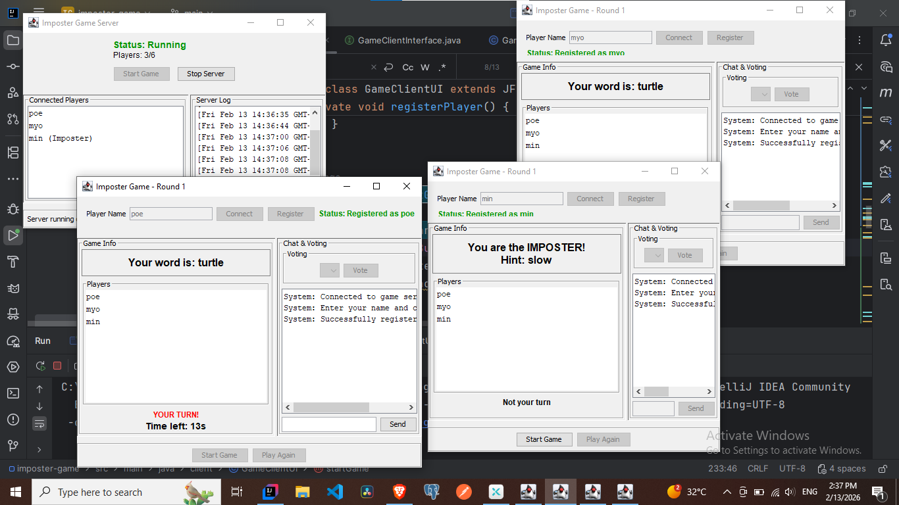

# Imposter Game Using Java RMI
- ✅ Registration System: Players can register with unique names
- ✅ Minimum Players: Game requires at least 3 players to start
- ✅ Imposter Selection: Random player becomes imposter
- ✅ Word Distribution: All players get same word, imposter gets hint only
- ✅ Turn-based Chat: 30 seconds per player, 3 rounds
- ✅ Voting System: Players vote for suspected imposter
- ✅ Results Display: Shows who the imposter was and if caught
- ✅ Replay Option: Players can start a new game
- ✅ Swing UI: Both server and client have graphical interfaces
- ✅ Real-time Updates: Player list, game state, timer updates

